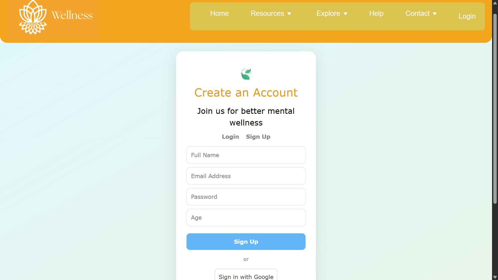
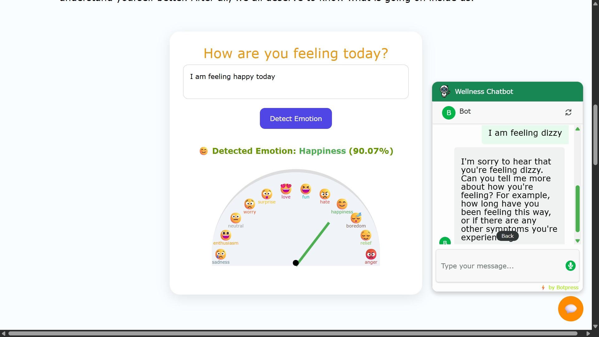
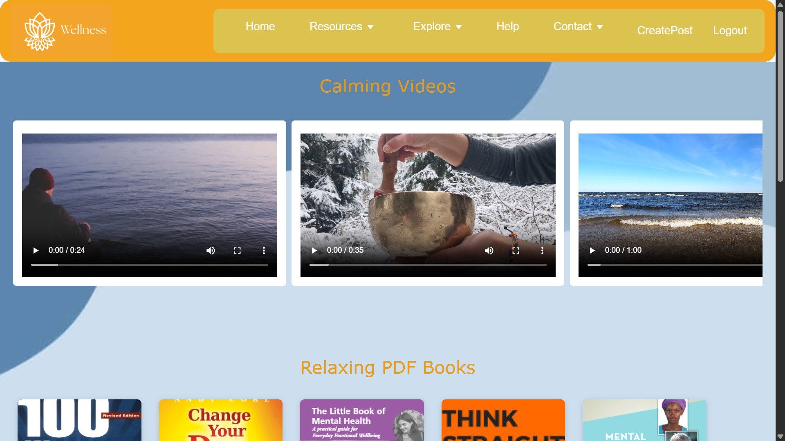
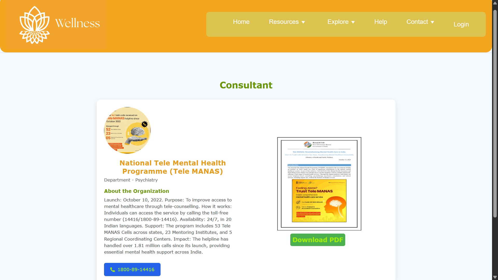

# Wellness - An AI-Powered Mental Health Chatbot with Emotion Recognition

**Wellness** (Hindi: *Peace*) is an innovative AI-powered mental health support platform that aims to break the stigma surrounding mental health issues and provide accessible, personalized, and comprehensive resources to users. By leveraging natural language processing (NLP) and machine learning (ML), Wellness recognizes emotions from text inputs, offering empathetic and tailored responses to support users on their mental health journey.

---

## Project Overview

This project seeks to address key challenges in mental health support:

- Limited accessibility to resources, especially in rural or underserved areas.
- Stigma around mental illness that discourages individuals from seeking help.
- Lack of personalized and contextually relevant support.
- Limited availability of mental health professionals.

Our chatbot is designed as an always-available companion that listens, understands, and responds to mental health concerns with empathy and relevant resources.

---

## Objectives

✔️ Develop an AI-powered chatbot integrated with text-based emotion recognition.  
✔️ Offer 24/7 conversational AI support to users.  
✔️ Provide a variety of resources: blogs, exercises, music, books, memes, doctor consultations, and government scheme information.  
✔️ Promote mental health awareness and reduce stigma.  
✔️ Improve mental health outcomes by offering tools for self-management.  
✔️ Conduct rigorous testing and evaluation to ensure effectiveness and user satisfaction.

---

## Tech Stack

- **Frontend**: React.js, HTML, CSS, Bootstrap  
- **Backend**: Node.js, Express.js  
- **AI/NLP**: Python (NLTK, spaCy, Transformers, TextBlob/VADER)  
- **Database**: MongoDB (optional)  
- **APIs**: JokeAPI, MemeGen API, REST APIs  
- **Deployment**: Heroku, AWS, Vercel  
- **Tools**: Postman, Git & GitHub, Anaconda/Jupyter Notebook

---

## Key Features

- **Chatbot**: Emotionally responsive, empathetic conversations.  
- **Emotion Detection**: Detects emotions like sadness, joy, anger, fear, and neutrality.  
- **Consultant Page**: Government helpline resources.  
- **Blog Section**: Users can read/write blogs to share experiences.  
- **Meme Generator**: Fun activity to lighten mood.  
- **Exercises & Media**: Videos, music, and book recommendations for relaxation and mental health improvement.  
- **Mental Health Quiz**: Interactive self-check tools.  
- **Secure Authentication**: Sign in via Google or email.

---

## Project Screenshots

| Home Page                                   |
|---------------------------------------------|
|         |

| Login Page                                 |
|--------------------------------------------|                        
|  |

| SignUp Page                                 |
|--------------------------------------------|                        
|  |

| Chatbot                                     |
|---------------------------------------------|
|        |

| Relax Page                            |
|-------------------------------------------------|
|  |

| Doctor Consult Page                                 |
|-----------------------------------------------------|
|  |


---

## Final Outcome

✅ Over 90% chatbot response accuracy during beta testing.  
✅ Emotion recognition accuracy: 85-88% (text-based sentiment models).  
✅ Positive feedback from users on emotional support and empathy.  
✅ Platform tested for privacy compliance and user data protection.  

---

##  Future Scope

 **Facial Emotion Recognition**: Integrating camera-based emotion detection.  
 **Voice-based Emotion Recognition**: Using speech tone and patterns for mood analysis.  
 **Multimodal Fusion**: Combining text, voice, and facial cues for deeper emotional understanding.  
 **Telehealth Integration**: Connecting with mental health professionals.  
 **Multilingual Support**: Breaking language barriers for mental health resources.

---

## 📁 Project Structure
MAJORPROJECT_WELLNESS/
├── Frontend/
│ ├── src/
│ │ ├── components/
│ │ ├── contexts/
│ │ ├── images/
│ │ ├── pages/
│ │ ├── index.jsx
│ │ ├── menuItems.jsx
│ │ └── ...
│ ├── public/
│ ├── package.json
│ └── ...
├── screenshots/
│ ├── doctor consult.jpg
│ ├── emotion.jpg
│ ├── HomePage.jpg
│ ├── LoginPage.png
│ ├── relax.png
│ └── signup.png
├── Backend/
│ ├── _pycache_
│ ├── config/
│ ├── middleware/
│ ├── models/
│ ├── routes/
│ ├── templates/
│ ├── main.py
│ ├── package.json
│ ├── server.js
│ └── ...
├── .gitignore
└── README.md


---

## Running the Project Locally

1️⃣ Clone the repository:

```bash
git clone https://github.com/KKapkoti/AI-Powered-Mental-Health-Chatbot-with-Emotion-Recognition.git
cd MAJORPROJECT_WELLNESS
```

2️⃣ Split the terminal and go to the Backend/Frontend folder

```bash
  cd Backend
  cd Frontend
```

Install dependencies in the respective directories
```bash
  npm install
```

3️⃣ Navigate to the server directory (Python FastAPI):
```bash
  cd server
```

4️⃣ Run the Python backend:
python main.py
or using Uvicorn (recommended for FastAPI):
uvicorn main:app --reload

5️⃣ Start the server in Backend folder

```bash
  node server.js
```

6️⃣Run the application in Frontend folder on your localhost

```bash
  npm run dev
```


## Authors
- Anchal Sharma [@mansir04](https://github.com/mansir04)
- Ankit Kumar [@shaheera02](https://github.com/shaheera02)
- Kavita Kapkoti [@KKapkoti](https://github.com/KKapkoti)
- Yogita [@yogitasharma15](https://github.com/yogitasharma15)


## References & Resources
GitHub Copilot
Node.js
Express.js
MongoDB
Bootstrap
Hugging Face Transformers
Figma for UI design

###

#### Note : This README is regularly updated as the project evolves. For the latest updates, please refer to the repository.

# AI-Powered-Mental-Health-Chatbot-with-Emotion-Recognition
